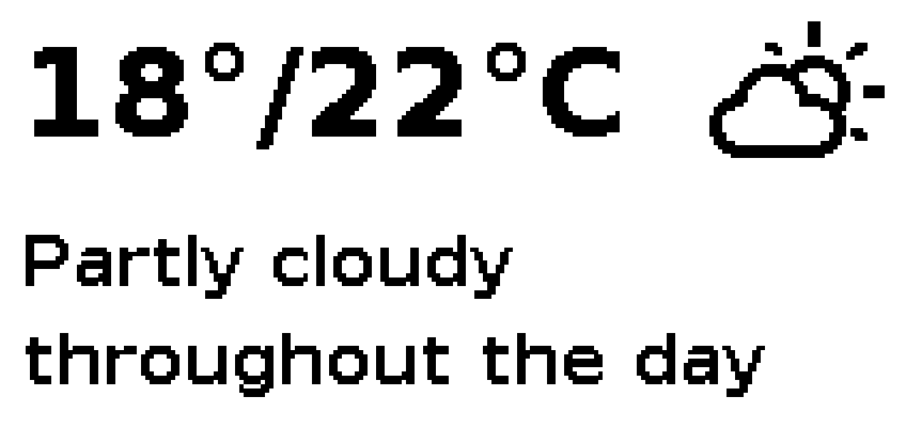

# Weather Station e-Paper Display

[](https://www.python.org/)
[](https://www.raspberrypi.org/)
[](https://pirateweather.net/)
[](LICENSE)

A Raspberry Pi weather station with Waveshare 2.13" e-Paper displays. Supports multiple display models (bi-color and monochrome). Shows current temperature, daily max, and weather summary.

- Current temperature, daily max temperature with a beautiful weather icon
- Multi-language weather summaries
- 10 supported Waveshare 2.13" display models (bi-color and monochrome)
- Desktop development with built-in e-Paper emulator



## Table of Contents

- [Quick Start](#quick-start)
- [What You Need](#what-you-need)
- [Installation](#installation)
- [Configuration](#configuration)
- [Usage](#usage)
- [Supported Display Models](#supported-display-models)
- [Development & Testing](#development--testing)
- [Troubleshooting](#troubleshooting)
- [File Structure](#file-structure)
- [Credits](#credits)
- [License](#license)

## Quick Start

> **TL;DR** - Get a free [Pirate Weather API key](https://pirate-weather.apiable.io/products/weather-data/plans), then run:

```bash
curl -fsSL https://raw.githubusercontent.com/benjaminburzan/weatherstation-epaper/main/install.sh | bash
```

The installer sets up everything: dependencies, SPI, configuration, and an optional systemd service. See [Installation](#installation) for manual setup.

## What You Need

### Hardware
- Raspberry Pi (Zero W, 3, 4, or 5)
- Any Waveshare 2.13" e-Paper display (see [Supported Display Models](#supported-display-models))
- Internet connection

### Software
- Free [Pirate Weather API key](https://pirate-weather.apiable.io/products/weather-data/plans)
- Raspberry Pi OS, DietPi, or Debian-based Linux distro
- DejaVu Sans Bold font (pre-installed on Raspberry Pi OS and DietPi)

## Installation

Run the installer on your Raspberry Pi — it handles SPI, dependencies, configuration, and the systemd service:

```bash
curl -fsSL https://raw.githubusercontent.com/benjaminburzan/weatherstation-epaper/main/install.sh | bash
```

> **Prefer manual setup?** Follow the step-by-step [Manual Installation Guide](docs/MANUAL_INSTALL.md) (pipx or venv).

### Updating

To update, simply re-run the installer — it detects the existing installation, upgrades the application, and keeps your configuration.

### Uninstalling

See the [Uninstall Guide](docs/MANUAL_INSTALL.md#uninstall) for step-by-step removal instructions.

## Configuration

All settings are configured via environment variables in your `.env` file.

| Variable | Description | Default |
|----------|-------------|---------|
| `PIRATE_WEATHER_API_KEY` | Your Pirate Weather API key | **Required** |
| `LATITUDE` | Your location's latitude | 52.5200 (Berlin) |
| `LONGITUDE` | Your location's longitude | 13.4050 (Berlin) |
| `LANGUAGE` | Weather summary language ([see options](https://pirateweather.net/en/latest/API/#language)) | de |
| `UNITS` | `si` for Celsius, `us` for Fahrenheit | si |
| `DISPLAY_MODEL` | Display model (see [Supported Display Models](#supported-display-models)) | epd2in13bc |
| `FLIP_DISPLAY` | Set to `true` to rotate display 180° | false |
| `UPDATE_INTERVAL_SECONDS` | How often to refresh (1800 = 30 min) | 1800 |

## Usage

### Manual Start

```bash
cd ~/weatherstation-epaper
source venv/bin/activate
python weatherstation.py
```

### Run as System Service (recommended)

For automatic startup on boot:

```bash
sudo cp weatherstation.service /etc/systemd/system/
sudo systemctl daemon-reload
sudo systemctl enable weatherstation
sudo systemctl start weatherstation
```

**Check status:**
```bash
sudo systemctl status weatherstation
```

**View logs:**
```bash
tail -f /var/log/weatherstation.log
```

## Supported Display Models

All Waveshare 2.13" e-Paper displays are supported:

### 104×212 Resolution

| Model | Type | Colors | Model ID |
|-------|------|--------|----------|
| [2.13" e-Paper HAT (B)](https://www.waveshare.com/wiki/2.13inch_e-Paper_HAT_(B)_Manual) | Bi-color | Black/Red | `epd2in13bc` (default) |
| [2.13" e-Paper HAT (D)](https://www.waveshare.com/wiki/2.13inch_e-Paper_HAT_(D)_Manual) | Monochrome | Black/White | `epd2in13d` |

### 122×250 Resolution

| Model | Type | Colors | Model ID |
|-------|------|--------|----------|
| [2.13" e-Paper HAT](https://www.waveshare.com/wiki/2.13inch_e-Paper_HAT_Manual) | Monochrome | Black/White | `epd2in13` |
| [2.13" e-Paper HAT V2](https://www.waveshare.com/wiki/2.13inch_e-Paper_HAT_Manual) | Monochrome | Black/White | `epd2in13_V2` |
| [2.13" e-Paper HAT V3](https://www.waveshare.com/wiki/2.13inch_e-Paper_HAT_Manual) | Monochrome | Black/White | `epd2in13_V3` |
| [2.13" e-Paper HAT V4](https://www.waveshare.com/wiki/2.13inch_e-Paper_HAT_Manual) | Monochrome | Black/White | `epd2in13_V4` |
| [2.13" e-Paper HAT (B) V3](https://www.waveshare.com/wiki/2.13inch_e-Paper_HAT_(B)_Manual) | Bi-color | Black/Red | `epd2in13b_V3` |
| [2.13" e-Paper HAT (B) V4](https://www.waveshare.com/wiki/2.13inch_e-Paper_HAT_(B)_Manual) | Bi-color | Black/Red | `epd2in13b_V4` |
| [2.13" e-Paper HAT (G)](https://www.waveshare.com/wiki/2.13inch_e-Paper_HAT_(G)_Manual) | 4-color | Black/White/Yellow/Red | `epd2in13g` |

**Features:**
- Bi-color displays: Red activates when current temp ≥ max temp
- Layout automatically scales based on display resolution
- All displays work with both hardware and emulator

## Development & Testing

### Development Configuration

| Variable | Description | Default |
|----------|-------------|---------|
| `USE_EMULATOR` | Use E-Paper-Emulator instead of hardware | false |
| `USE_TKINTER` | Use Tkinter window instead of browser (only with emulator) | false |
| `LOG_FILE_PATH` | Path to log file (use local path on macOS) | `/var/log/weatherstation.log` |
| `FONT_PATH` | TrueType font file (see [macOS font setup](#macos-install-font)) | `/usr/share/fonts/.../DejaVuSans-Bold.ttf` |

### Quick Setup (macOS/Linux)

```bash
# 1. Clone and setup (includes E-Paper-Emulator and pytest)
git clone https://github.com/benjaminburzan/weatherstation-epaper.git
cd weatherstation-epaper
python3 -m venv .venv
source .venv/bin/activate
pip install -e ".[dev]"

# 2. Setup environment
cp .env.example .env
# Edit .env and add your PIRATE_WEATHER_API_KEY

# 3. Run with emulator (opens in browser at http://localhost:5000)
USE_EMULATOR=true python weatherstation.py

# Or use Tkinter window instead of browser
USE_EMULATOR=true USE_TKINTER=true python weatherstation.py
```

### macOS: Install Font

```bash
# DejaVu Sans is required (pre-installed on Raspberry Pi OS and DietPi)
brew install font-dejavu

# Add to .env
echo "FONT_PATH=~/Library/Fonts/DejaVuSans-Bold.ttf" >> .env
```

### Test Different Display Models

```bash
# Bi-color (black/red) - opens in browser
USE_EMULATOR=true DISPLAY_MODEL=epd2in13bc python weatherstation.py

# Monochrome (black/white) - opens in browser
USE_EMULATOR=true DISPLAY_MODEL=epd2in13d python weatherstation.py
```

**Note:** The emulator uses Flask and serves at http://localhost:5000 by default. Set `USE_TKINTER=true` if you prefer a native window.

### Running Tests

```bash
python -m pytest tests/ -v
```

## Troubleshooting

### Display not updating

1. Check SPI is enabled: `ls /dev/spi*`
2. Verify wiring connections
3. Check logs: `tail -f /var/log/weatherstation.log`

### API errors

1. Verify your API key: `echo $PIRATE_WEATHER_API_KEY`
2. Check internet: `ping pirateweather.net`
3. Ensure coordinates are valid decimal numbers

### Service not starting

1. Check status: `sudo systemctl status weatherstation`
2. Verify paths in service file match your installation
3. Ensure `.env` file exists with valid API key

### Permission errors

```bash
sudo touch /var/log/weatherstation.log
sudo chmod 666 /var/log/weatherstation.log
```

### Display hangs or infinite busy wait

If the display appears stuck with no updates and logs show it hanging at "Displaying weather on e-Paper display...", the Waveshare driver is waiting indefinitely for the BUSY pin. This is a known hardware issue on Raspberry Pi Zero where the Driver HAT's power management circuit causes the display controller to lose power during reset.

**Quick fix for Pi Zero:**

```bash
curl -fsSL https://raw.githubusercontent.com/benjaminburzan/weatherstation-epaper/main/fix-pi-zero-readbusy.sh | bash
sudo systemctl restart weatherstation
```

This installs the upstream GitHub driver (which includes PWR_PIN support), creates a compatibility wrapper, and patches ReadBusy with a 10-second timeout. See the complete guide: [Pi Zero ReadBusy Fix](docs/PI_ZERO_READBUSY_FIX.md)

**Note:** The fix must be reapplied after `pipx upgrade weatherstation-epaper`.

## File Structure

```
weatherstation-epaper/
├── install.sh                  # Automated installer for Raspberry Pi
├── fix-pi-zero-readbusy.sh     # Pi Zero ReadBusy hang fix script
├── weatherstation.py           # Main application
├── display_config.py           # Display configuration and module loading
├── emulator_adapter.py         # E-Paper-Emulator adapter for testing without hardware
├── weatherstation.service      # Systemd service file
├── requirements.txt            # Python dependencies
├── .env                        # Your configuration (create from .env.example)
├── .env.example                # Configuration template
├── icons/                      # Weather icon assets
│   ├── icons.json              # Weather icon unicode mapping
│   └── weathericons.ttf        # Weather icons font
├── tests/                      # Test files
│   ├── test_weatherstation.py
│   ├── test_display_config.py
│   └── test_emulator_integration.py
└── docs/
    ├── PI_ZERO_READBUSY_FIX.md # Pi Zero busy pin fix guide
    └── MANUAL_INSTALL.md       # Manual installation guide
```

## Credits

- Weather icons: [Erik Flowers Weather Icons](https://github.com/erikflowers/weather-icons)
- Weather data: [Pirate Weather API](https://pirateweather.net/)
- e-Paper library: [Waveshare e-Paper](https://github.com/waveshareteam/e-Paper)

## License

MIT License - see [LICENSE](LICENSE)
